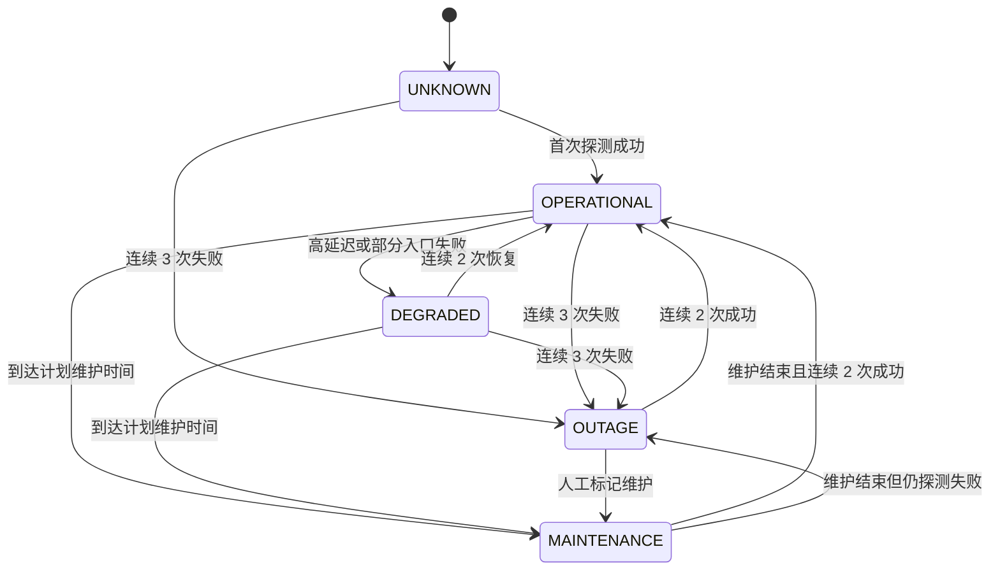
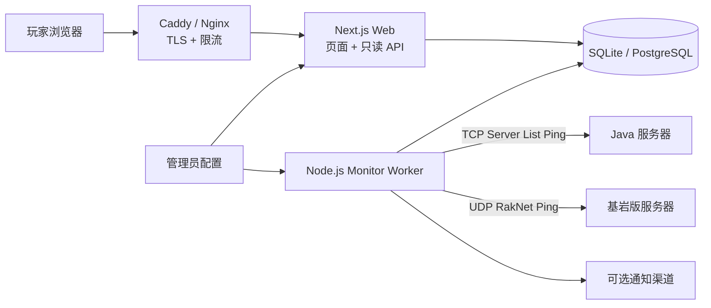

# Minecraft 服务器状态页路线图（非规范性文档）

> 文档状态：产品与技术路线图，不是当前实现规范。  
> 当前实现以 [文档首页](index.md)、[架构文档](architecture.md)、[配置参考](configuration.md)、[API 参考](api.md) 和代码为准。  
> 更新日期：2026-07-22

## 当前实现对照

| 能力 | 当前状态 |
|---|---|
| 一个 Java 与一个基岩版入口 | 已实现 |
| 独立 Web + Monitor + SQLite WAL | 已实现 |
| 60 秒默认检测、3 次失败/2 次恢复 | 已实现 |
| 在线人数趋势与 30 格可用性条 | 已实现 |
| 手动临时检查与 SVG 状态标签 | 已实现 |
| 多服务器模型、事件系统、管理后台 | 未实现 |
| 通知、订阅、多探测点、深度指标 | 未实现 |
| PostgreSQL 迁移 | 未来方向 |

---

# 原始产品与技术方案（路线图）

> 以下内容保留为未来设计参考。表、接口、目录与验收项除非在“当前实现对照”中标记为已实现，否则均不代表当前代码能力。

## 1. 目标与假设

### 1.1 产品目标

为玩家提供一个独立于 Minecraft 游戏服的公开状态页，让玩家可以快速回答以下问题：

1. 服务器现在能否加入？
2. 应该使用哪个地址、端口和游戏版本？
3. 当前有多少玩家，连接延迟大致如何？
4. 最近是否发生过故障或维护？
5. 过去一段时间的稳定性如何？

### 1.2 当前假设

- 面向公开玩家访问，不要求玩家登录。
- 首期支持 1～10 个 Java 版、基岩版或 Geyser 双端入口。
- 状态页部署在与游戏服不同的机器或平台上。
- 首期通过 Minecraft 状态协议探测，不依赖 RCON，也不在网页中保存游戏服管理凭据。
- 默认每 60 秒检测一次，页面展示的数据最多延迟约 60～90 秒。
- 管理员可以通过配置文件管理服务器；可视化后台放到后续迭代。

## 2. 范围

### 2.1 MVP 必须包含

- 全局状态：全部正常、部分异常、全部离线、计划维护、数据未知。
- 每个服务器的在线状态、版本、延迟、在线人数/人数上限。
- 服务器名称、版本类型、连接地址与一键复制。
- MOTD 和服务器图标；内容必须经过安全解析和转义。
- 最近 24 小时延迟趋势。
- 最近 30 天每日可用率。
- 当前及历史故障/维护事件。
- 最后检测时间、自动刷新和移动端适配。
- 基础 SEO、Open Graph 分享图信息、无障碍状态文本。

### 2.2 后续可选能力

- 管理后台：增删服务器、发布维护、编辑故障说明。
- Discord、邮件或 Webhook 故障通知。
- 订阅故障更新。
- 多区域探测，区分“服务器宕机”和“单一探测点网络异常”。
- TPS、MSPT、CPU、内存、磁盘、代理后端节点状态。
- 玩家趋势、版本分布、地图链接、投票/白名单入口。
- 多语言与主题切换。

### 2.3 明确不纳入 MVP

- 不提供启动、停止、重启服务器等远程管理操作。
- 不公开 RCON，也不把任意主机探测能力暴露成公共 API。
- 不承诺从标准状态协议获取 TPS、CPU、内存等内部指标；这些数据需要服务端插件、Exporter 或受控 Agent。
- 不依赖公开第三方 Minecraft 状态 API 作为唯一数据源。

## 3. 推荐方案

### 3.1 方案对比

| 方案 | 优点 | 缺点 | 结论 |
|---|---|---|---|
| 静态网页直接调用第三方状态 API | 开发最快、无需后端 | 受第三方限流和故障影响；难以形成可信历史；浏览器跨域受限 | 只适合原型 |
| 自建协议探测器 + 状态 API + 历史库 | 数据可控；可记录可用率；Java/基岩版都可扩展 | 需要运行一个常驻探测服务 | **MVP 推荐** |
| 游戏服插件/Agent + 监控平台 | 可获取 TPS、资源使用等深度指标 | 耦合游戏服；部署和权限更复杂 | 第二阶段按需增加 |

### 3.2 推荐技术栈

- 语言：TypeScript，前后端共享状态类型和校验规则。
- Web：Next.js App Router，负责页面、只读 API 和服务端渲染。
- 样式：Tailwind CSS + 少量自定义 CSS 变量，建立 Minecraft 风格的设计令牌。
- 探测器：独立 Node.js Worker；使用维护活跃、支持 Java/基岩版与 SRV 解析的协议库，并在实现时锁定依赖版本。
- 数据访问：Drizzle ORM。
- MVP 数据库：SQLite + WAL，单机低频写入足够；扩大到多实例或多探测点时迁移 PostgreSQL。
- 图表：首期使用轻量 SVG 折线和状态条，避免为了两个小图引入大型图表依赖。
- 部署：Docker Compose + Caddy/Nginx 反向代理；Web、Worker 与数据卷分离。
- 自动化：CI 执行类型检查、单元测试、构建和容器健康检查。

Next.js 官方支持 Node.js 和 Docker 自托管；生产环境在应用前放置反向代理，可负责 TLS、请求限制和异常请求防护。探测器需要访问 Java 版 TCP 端口和基岩版 UDP 端口，因此不应默认部署到限制原始 TCP/UDP 出站连接的纯静态或 Edge 环境。

### 3.3 为什么拆分 Web 与 Worker

- HTTP 请求不直接触发游戏服探测，避免刷新风暴和被动 DDoS。
- 页面始终读取最近一次快照，响应速度稳定。
- 探测失败不会阻塞网页渲染。
- Worker 可以独立设置超时、重试、抖动与告警规则。
- 后续可以增加第二个探测点而不改页面结构。

## 4. 信息架构与页面草图

首期只需要一个公开首页，详情通过卡片和可展开区域呈现；服务器较多时再增加独立详情页。

```text
┌──────────────────────────────────────────────────────┐
│ Logo / 服务器名称                    [全部系统正常 ●] │
├──────────────────────────────────────────────────────┤
│ 当前状态概览                                         │
│ “所有服务器均可正常加入”              最后更新 12:30 │
├──────────────────────────────────────────────────────┤
│ Java 生存服                                    在线  │
│ play.example.com  [复制]                             │
│ 18 / 100 玩家     1.21.x     42 ms                   │
│ MOTD                                                 │
│ [最近 24h 延迟折线]  [最近 30 天可用状态条]          │
├──────────────────────────────────────────────────────┤
│ 基岩版入口                                    维护中  │
│ bedrock.example.com:19132 [复制]                     │
├──────────────────────────────────────────────────────┤
│ 事件记录                                             │
│ 07-20 网络波动（已恢复）                             │
│ 07-25 计划维护（计划中）                             │
├──────────────────────────────────────────────────────┤
│ 帮助 / 社区链接 / 状态说明 / 隐私说明                │
└──────────────────────────────────────────────────────┘
```

### 4.1 视觉方向

- 深色背景、草方块绿作为主色，石材灰作为中性色，红石红用于故障，金色用于维护。
- Minecraft 元素只用在像素边角、图标、纹理和标题点缀，正文优先可读性。
- “在线/离线”同时使用颜色、图标和文字，不能只依赖颜色表达。
- 数字使用等宽字体；正文使用清晰的系统无衬线字体。
- 尊重 `prefers-reduced-motion`，状态变化不使用持续闪烁动画。

## 5. 状态探测设计

### 5.1 可获取信息

Java 版使用 Server List Ping，经 TCP 获取：

- 在线状态和往返延迟。
- 版本名称与协议号。
- 在线人数与人数上限。
- MOTD。
- 服务器图标。
- 可选的玩家样本；服务端可能不返回，因此不能把它当作完整在线列表。
- 域名配置 SRV 记录时解析实际目标，但页面仍展示玩家使用的公开地址。

基岩版通过 UDP/RakNet 未连接 Ping 获取：

- 在线状态和延迟。
- 版本、人数、MOTD、游戏模式等服务端实际返回字段。

### 5.2 检测策略

| 项目 | MVP 默认值 | 说明 |
|---|---:|---|
| 检测周期 | 60 秒 | 每台服务器加入 0～10 秒随机抖动 |
| 单次超时 | 5 秒 | DNS、连接和协议读取都必须有上限 |
| 并发数 | 5 | 防止配置错误时耗尽连接资源 |
| 判定离线 | 连续 3 次失败 | 过滤短暂丢包，约 3 分钟后确认 |
| 判定恢复 | 连续 2 次成功 | 避免在线/离线反复抖动 |
| 数据过期 | 超过 3 个检测周期 | 标记“未知”，不把旧数据伪装为在线 |
| 原始数据保留 | 90 天 | 后续按天聚合后可清理 |

超时、DNS 失败、拒绝连接、协议异常需要保存为不同错误码，但公开页面只展示适合玩家理解的文案，详细错误保留在日志中。

### 5.3 状态机



建议首期将“性能下降”定义为以下任一条件：

- Java/基岩双入口中只有部分入口可用。
- 最近 5 次成功探测的中位延迟高于配置阈值，默认 300 ms。
- 数据源可用但关键字段持续异常。

阈值应按探测机与游戏服的实际网络距离调整，不能把一个全球统一延迟值写死。

### 5.4 可用率口径

```text
可用率 = 成功检测次数 / 有效检测总次数 × 100%
```

- “计划维护”从 SLA 可用率分母中排除，但在状态条中以金色单独显示。
- 探测器自身中断造成的“未知”不计作游戏服宕机，也不计入有效检测。
- 页面必须提供口径说明，避免把监控盲区显示成 100% 可用。
- 每日聚合保存成功、失败、维护、未知的采样数，不只保存最终百分比。

## 6. 系统架构



### 6.1 请求与数据流

1. Worker 从受信任配置中读取服务器列表。
2. 定时器为每台服务器创建带超时的探测任务。
3. Worker 标准化 Java/基岩版返回结果，写入 `check_results`。
4. 状态机更新 `server_snapshots`，必要时创建或解决自动故障事件。
5. Web API 从快照和聚合表读取数据，设置短时缓存。
6. 浏览器每 60 秒重新拉取状态；页面失去焦点时降低刷新频率。

### 6.2 建议目录结构

```text
Minecraft-Server-Status/
├─ apps/
│  ├─ web/                 # Next.js 页面与只读 API
│  └─ monitor/             # 定时探测 Worker
├─ packages/
│  ├─ core/                # 状态枚举、规则、共享类型
│  ├─ database/            # Schema、迁移、查询
│  └─ config/              # 环境变量与服务器配置校验
├─ docs/
├─ deploy/
│  ├─ compose.yaml
│  └─ Caddyfile
├─ .env.example
└─ README.md
```

## 7. 数据模型

### 7.1 `servers`

| 字段 | 类型 | 说明 |
|---|---|---|
| `id` | UUID/Text | 主键 |
| `slug` | Text Unique | URL 和稳定标识 |
| `name` | Text | 展示名称 |
| `edition` | Enum | `JAVA` / `BEDROCK` |
| `host` | Text | 实际探测主机，仅服务端可见 |
| `port` | Integer | 探测端口 |
| `display_address` | Text | 玩家复制的地址 |
| `enabled` | Boolean | 是否启用探测与展示 |
| `sort_order` | Integer | 页面排序 |
| `created_at` / `updated_at` | DateTime | 审计字段 |

### 7.2 `check_results`

| 字段 | 类型 | 说明 |
|---|---|---|
| `id` | Integer/BigInt | 主键 |
| `server_id` | Foreign Key | 对应服务器 |
| `checked_at` | DateTime | 检测时间，统一存 UTC |
| `success` | Boolean | 协议探测是否成功 |
| `latency_ms` | Integer Nullable | 成功时的延迟 |
| `players_online` / `players_max` | Integer Nullable | 玩家数 |
| `version_name` / `protocol` | Text/Integer Nullable | 版本信息 |
| `motd` | JSON/Text Nullable | 安全标准化后的 MOTD |
| `favicon_hash` | Text Nullable | 图标变化标识，图标本体去重保存 |
| `error_code` | Text Nullable | 标准化错误类型 |

### 7.3 `server_snapshots`

每台服务器一行，保存当前状态、连续成功/失败次数、最后成功时间、最近错误和最新展示数据。首页只读取此表，避免每次请求扫描历史数据。

### 7.4 `daily_stats`

按服务器和 UTC 日期聚合成功、失败、维护、未知次数，以及平均、P50、P95 延迟。页面再根据访问者时区格式化标签。

### 7.5 `incidents` 与 `incident_updates`

- 事件字段：类型、状态、影响范围、标题、开始/结束时间、是否自动创建。
- 更新字段：事件 ID、状态、说明、发布时间。
- 自动事件可以由状态机创建和解决；管理员补充面向玩家的说明。

## 8. API 草案

所有公开接口只读，不接受用户提供的 `host` 或 `port`。

### 8.1 `GET /api/v1/status`

返回首页首屏所需的完整快照，减少浏览器请求数。

```json
{
  "overallStatus": "OPERATIONAL",
  "checkedAt": "2026-07-21T04:30:00Z",
  "stale": false,
  "servers": [
    {
      "slug": "survival-java",
      "name": "Java 生存服",
      "edition": "JAVA",
      "status": "OPERATIONAL",
      "displayAddress": "play.example.com",
      "version": "1.21.x",
      "players": { "online": 18, "max": 100 },
      "latencyMs": 42,
      "motd": [{ "text": "欢迎来到生存服", "color": "green" }]
    }
  ],
  "activeIncidents": []
}
```

### 8.2 其他公开接口

- `GET /api/v1/servers/{slug}/history?range=24h|7d|30d`
- `GET /api/v1/incidents?status=active|resolved&limit=20`
- `GET /api/health/live`：Web 进程存活。
- `GET /api/health/ready`：数据库迁移完成且可读取。

历史接口限制时间范围和最大点数，由服务端降采样，避免返回无限数据。

## 9. 安全与可靠性

### 9.1 必须落实

- 服务器目标只能来自受信任配置或受保护后台，防止 SSRF 与内网端口扫描。
- 禁止环回地址、链路本地地址、云元数据地址和未授权私网目标；如果游戏服确实位于私网，使用显式 allowlist。
- MOTD 永远按数据结构渲染并进行 HTML 转义，不直接注入服务端返回的 HTML。
- 校验图标 MIME、尺寸和解码后大小；异常图标丢弃。
- 所有网络操作使用超时、响应大小上限和并发上限。
- 日志不记录管理密钥、完整堆栈到公开 API 或玩家敏感信息。
- 管理接口后续单独鉴权，并写审计日志；不能依赖隐藏 URL。
- 反向代理开启 HTTPS、安全响应头、压缩与基础限流。
- 数据库每日备份；至少定期执行一次恢复演练。

### 9.2 监控系统自身的健康

状态页也可能故障，因此需要记录：

- Worker 最后心跳与任务延迟。
- 每分钟探测成功/失败数量。
- 数据库写入错误与磁盘空间。
- Web API 错误率和响应时间。
- 快照是否过期。

首期可以用结构化日志和简单健康检查；规模扩大后再接 Prometheus/Alertmanager。告警应针对玩家可感知症状，并设置持续时间，避免一次丢包就通知管理员。

## 10. 部署方案

### 10.1 推荐拓扑

- 状态页部署在独立 VPS 或容器主机，不与 Minecraft 游戏进程共存。
- 单机 Docker Compose 运行 `proxy`、`web`、`monitor`，SQLite 数据放持久卷。
- DNS 使用独立域名，例如 `status.example.com`。
- 状态页主机允许出站访问目标游戏服的 TCP/UDP 端口。
- 游戏服防火墙只需允许探测机 IP 与真实玩家流量；若无法固定探测机 IP，应谨慎设置规则。

### 10.2 环境配置示例

```dotenv
APP_BASE_URL=https://status.example.com
DATABASE_URL=file:/data/status.db
CHECK_INTERVAL_SECONDS=60
CHECK_TIMEOUT_MS=5000
DOWN_AFTER_FAILURES=3
UP_AFTER_SUCCESSES=2
HISTORY_RETENTION_DAYS=90
```

服务器列表建议使用受版本控制的 YAML/JSON 配置，真实 `host` 可以从环境变量注入；公开 API 只返回 `displayAddress`。

## 11. 测试策略

### 11.1 单元测试

- 状态机：连续失败、恢复、维护覆盖、数据过期。
- 可用率：维护与未知样本的分母处理。
- Java/基岩版响应标准化。
- MOTD 和图标的安全解析。
- 时间范围、降采样和时区边界。

### 11.2 集成测试

- 使用录制的协议响应与本地假服务器测试成功、超时、拒绝连接、畸形包。
- Worker 写入后，API 返回正确快照。
- 数据迁移和每日聚合作业可重复执行。
- Docker 容器重启后历史数据不丢失。

### 11.3 端到端测试

- 首页状态、复制地址、自动刷新、历史图表。
- 手机、桌面、慢网络和 JavaScript 失败时的基本内容。
- 键盘操作、焦点、对比度、屏幕阅读器状态文本。

## 12. MVP 验收标准

- 配置 Java 或基岩版服务器后，90 秒内能在首页看到首次状态。
- 在线时正确显示版本、人数、MOTD、延迟和连接地址。
- 连续 3 次失败后显示离线；连续 2 次成功后恢复在线。
- 数据超过 3 个检测周期未更新时显示未知，而不是继续显示在线。
- 可查看最近 24 小时延迟和最近 30 天可用状态。
- 计划维护与意外故障有不同的视觉和统计口径。
- 公共接口无法探测配置之外的主机。
- MOTD 中的恶意 HTML/脚本不会执行。
- 页面在常见手机宽度下无横向滚动，并具备明确的加载、空数据和错误状态。
- Web 或 Worker 容器重启后，历史记录仍存在。

## 13. 实施计划

### 阶段 0：需求确认（0.5 天）

- 确认服务器版本、数量、地址、端口、Geyser/代理结构。
- 确认品牌名、Logo、主题和需要展示的社区入口。
- 确认部署位置与域名。

### 阶段 1：数据链路（1～1.5 天）

- 初始化工作区、共享类型、数据库迁移。
- 完成 Java/基岩版探测器、超时与状态机。
- 写入快照、历史记录和每日聚合。

### 阶段 2：公开页面（1～1.5 天）

- 完成状态总览、服务器卡片、复制地址和 MOTD。
- 完成延迟折线、30 天状态条和事件列表。
- 完成响应式、无障碍和基础 SEO。

### 阶段 3：部署与加固（1 天）

- Docker Compose、反向代理、HTTPS 与持久卷。
- 完成测试、健康检查、备份和运行手册。
- 用真实服务器进行阈值校准与上线验收。

在服务器资料和部署环境明确、首期不做管理后台的情况下，MVP 预计约 3.5～4.5 个开发日。视觉定制、通知渠道和复杂代理拓扑需要另外评估。

## 14. 开发前需要确认的问题

1. 首期监控的是 Java 版、基岩版，还是 Geyser 的两个入口？
2. 有多少个服务器或子服？是否经过 Velocity/BungeeCord 等代理？
3. 玩家实际复制的域名、端口是什么？探测地址是否与公开地址不同？
4. 是否展示玩家样本名称？从隐私和完整性考虑，默认建议只展示人数。
5. 是否需要把计划维护和故障通知到 Discord、邮件或其他渠道？
6. 是否已有域名、Logo、主色和参考网站？
7. 状态页可以部署在哪里？是否能与游戏服分开并支持 TCP/UDP 出站？
8. 首期是否需要管理员后台，还是使用配置文件和数据库脚本即可？

## 15. 建议的第一版决策

若暂时没有额外偏好，建议直接按以下基线进入开发：

- 单页公开状态页，深色 Minecraft 风格。
- Java 和基岩版数据模型都支持，先配置现有入口。
- 只展示人数，不公开玩家名称。
- 60 秒探测；3 次失败判定离线；2 次成功判定恢复。
- Next.js Web + 独立 Node.js Worker + SQLite。
- Docker Compose 部署在独立主机，Caddy 自动处理 HTTPS。
- 首期使用配置文件，不做管理员后台和通知订阅。
- 保存 90 天原始检测数据，展示 24 小时延迟与 30 天可用率。

## 16. 参考资料

- [Next.js：Self-Hosting](https://nextjs.org/docs/app/guides/self-hosting)
- [Next.js：Deploying](https://nextjs.org/docs/app/getting-started/deploying)
- [PrismarineJS：node-minecraft-protocol](https://github.com/PrismarineJS/node-minecraft-protocol)
- [MineScope：mineping（Java/Bedrock Ping）](https://github.com/minescope/mineping)
- [Prometheus：Alerting practices](https://prometheus.io/docs/practices/alerting/)

